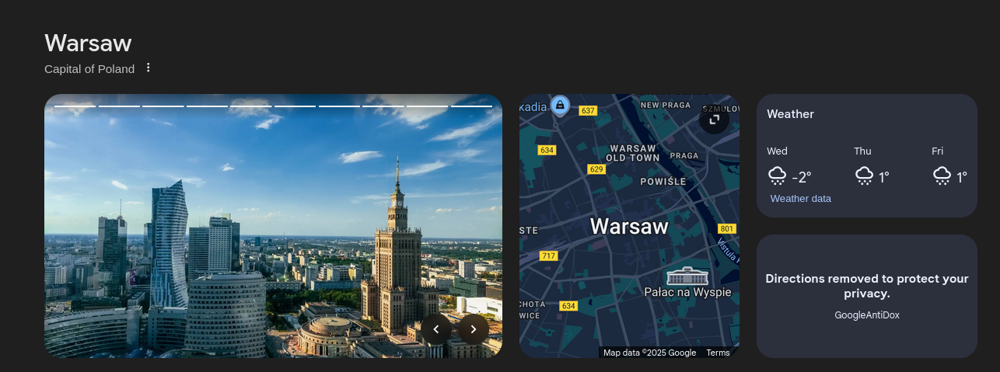
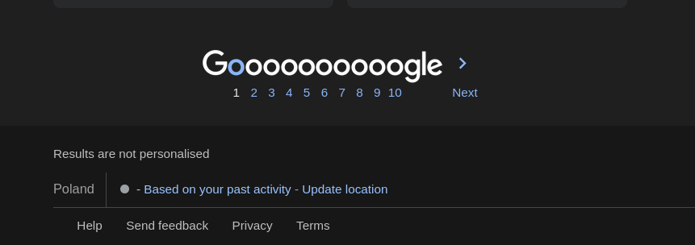
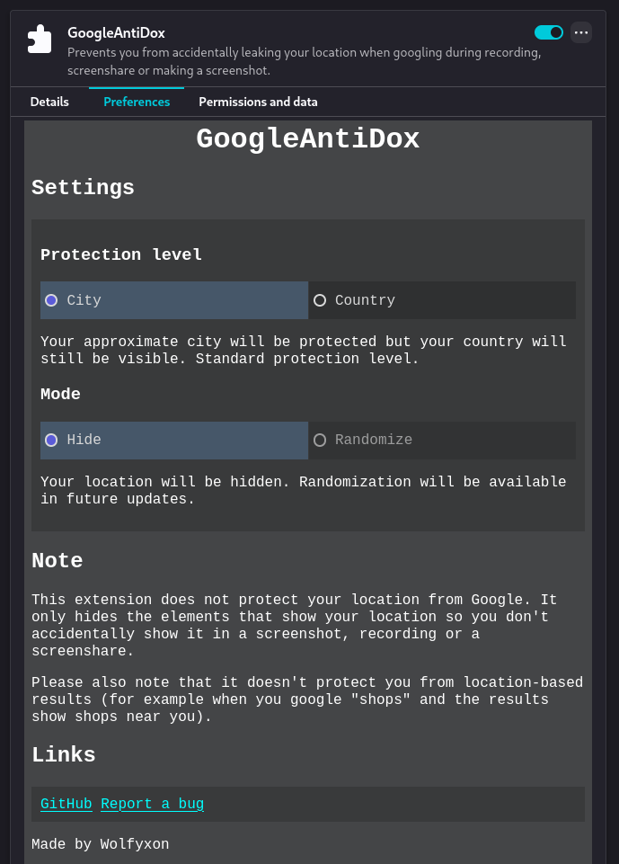

# GoogleAntiDox
A browser extension that removes things that give off your location in Google search.
Prevents you from accidentally leaking sensitive information when making screenshots.

Should be compatible with Firefox and all Chromium-based browsers.

> [!IMPORTANT]
> This extension is not guaranteed to work if Google changes their code. If it doesn't work, open an issue ASAP!

## Features
- [x] Hiding location from the footer
- [x] Hiding the directions widget
- [x] Hiding immediately (before the page fully loads)
- [ ] Random location mode

## Screenshots






## Installing

### From an extension store

- **Firefox** - Soon available.
- **Chrome** - You have to install it manually. Google requires you to publicly disclose your full name and address on the Chrome Web Store and I'm not comfortable with that.

## Manual

### Chromium (Chrome, Edge, Brave, Opera)
1. Download and extract the source code
2. Open your browser and go to `chrome://extensions`
3. Turn on *developer mode* in the top right corner
4. Click *load unpacked* on the top right
5. Navigate to the repository files
6. Select the *extension* folder
7. Done

### Firefox
**Note**: Due to Firefox's security, manually installed extensions are removed when you close your browser. Please use the Firefox Add-Ons store when the extension becomes available there.

1. Build the extension or download the source code
2. Open Firefox and go to `about:debugging`
3. Click on *This Firefox* on the left
4. Click *Load temporary addon*
5. Find and open the extension `.xpi` file or any file in the *extension* source code folder
6. Done

## Building
### Automated
Install `make` and run
```
make
```
or
```
make build
```

### Manual
Simply archive the *extension* folder in the zip format, then change the extension to `.xpi`.

Structure:
```
GoogleAntiDox.xpi
|_ manifest.json
|_ src
    |_ main.js
|_ styles
    |_ main.css
```
